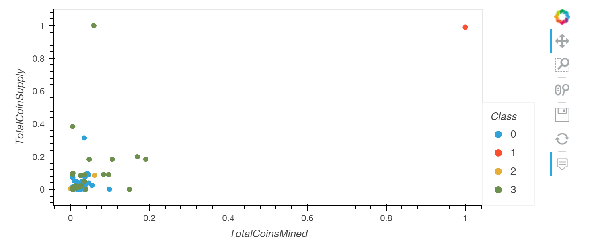
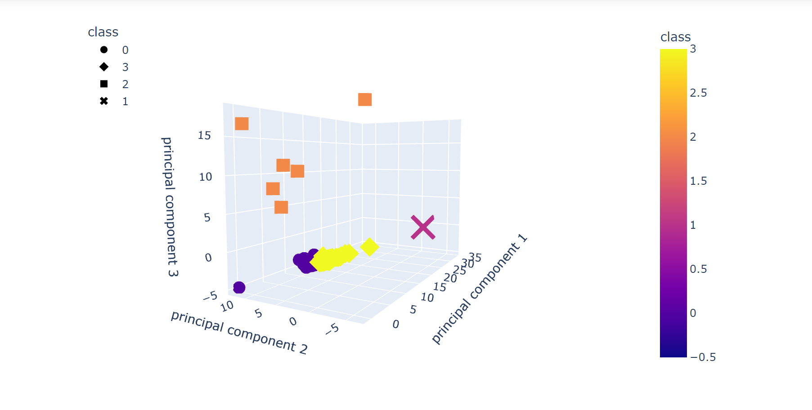

# Cryptocurrencies

## Overview

The crypto_clustering notebook first proprocesses the cryptocurrency data by refining features, converting string columns to separate binary columns using pandas get dummies function, and standardizing features with ranges that span too large effective machine learning. Then comes the process of reducing data dimensions utilizing PCA or principal component analysis to better visualize the data for interpretation. An elbow curve is created to determine the ideal number of clusters for the dataset which is followed with the Clustering of the data with a K-Means model. The data is finally visualized for viewing with a 2d-scatter and a 3d-scatter plot.

2d-scatter of TotalCoinsMined and TotalCoinSupply with hvplot 

3d-scatter of PCA with plotly express 

